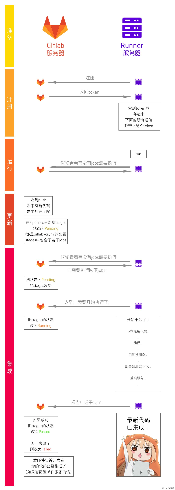

# 使用gitlab-runner实现分布式CI部署

## 目标

在项目开发时，往往需要同步编写技术文档，而技术文档较为普遍的部署方式是类似于gitbook或者ReadTheDocs的在线网络文档结构。

本文介绍了一种在同时使用gitlab管理代码的同时，也同步管理和部署项目技术文档，并且实现在线技术文档的更新与代码的提交同步。

该方法类似于gitlab的pages功能，不过不同之处在于，gitlab的pages直接通过gitlab所部署的服务器进行CI运行和编译部署。然而，在某些场合我们并没有办法直接使用gitlab的服务器进行编译环境的安装和部署，否则会造成一些环境错乱以及安全隐患；再则，gitlab服务器的http 80端口往往已经被gitlab站点所占用，或者nginx的80端口被重写到别的应用，不能用于访问项目文档。

因此我们需要实现跨服务器部署项目文档的CI，即使用另一台服务器，实现对在线文档的部署。本文的这种实现方法得益于gitlab-runner的跨服务器运行机制。

## 软件与工具

- gitlab

- gitlab-runner

- sphinx

- markdown

- sphinx_rtd_theme

- git

- nginx

- texlive-full

  

## Gitlab 服务端与Runner交互过程



## 安装gitlab-runner

### 安装

首先需要在gitlab-runner的服务器上安装gitlab-runner。

```bash
curl -L https://packages.gitlab.com/install/repositories/runner/gitlab-runner/script.deb.sh | sudo bash
sudo apt-get install gitlab-runner
```

### 注册runner

1. 开启注册

   `sudo gitlab-runner register `

2. 输入gitlab服务器的URL,获取gitlab服务器地址和令牌(token)。这两个信息位于gitlab的**项目->用户设置->CI/CD->Runner->指定Runner->手动设置specific Runner**中。
3. 输入Runner的描述，这是为了翻遍用户记忆的描述，用于用户区分不同的runner和分辨不同的功能。你可以稍后在GitLab的UI中进行更改。

4. 输入与Runner关联的标签，稍后可以在GitLab的用户界面中进行更改。

   > 注意，此处设置的关联标签将在gitlab-ci.yml文件中使用tags指定选择标签，否则不能正常进入该标签的作业。当5中设置为true则不需要指定标签。

5. 选择Runner是否应该选择没有标签的作业，可以稍后在GitLab的UI中进行更改（默认为false）：

6. 选择是否将Runner锁定到当前项目，稍后可以在GitLab的UI中进行更改。Runner特定时有用（默认为true）：

7. 输入Runner执行者：

   Please enter the executor: ssh, docker+machine, docker-ssh+machine, kubernetes, docker, parallels, virtualbox, docker-ssh, shell:
   shell #本人选择的是shell

至此 gitlab-runner配置完成

## 配置免秘钥登录

在完成以上gitlab-runner安装和注册之后，会在runner的服务器上产生一个gitlab-runner的用户，该用户为runner的运行程序主体。

### 生成秘钥

```bash
su gitlab-runner
cd
ssh-keygen
cat .ssh/id_rsa.pub
```

### 配置gitlab免密clone

将打印出的秘钥复制到**gitlab->用户->设置->SSH秘钥->添加SSH密钥**中。

以上即实现了在runner服务器上的gitlab-runner用户免密码克隆和更新gitlab服务器上的项目。


## 安装自动化文档软件

在runner服务器上安装以上依赖软件。

此处依据[配置sphinx文档系统](sphinx-docs.html)完成。


## 设置项目CI过程

有了以上gitlab-runner以及sphinx软件，就可以支持gitlab上项目的自动生成、更新在线文档了。

首先查看**项目->用户设置->CI/CD->Runner**下会产生一个刚才注册的runner，除了可以启用和暂停之外，也可以点击编辑按钮进去修改刚才注册时输入的参数。


gitlab项目的CI主要通过在项目目录下的隐藏文件.gitlab-ci.yml文件配合runner实现。

我们的参考模板为：

```xml
stages:
  - build
  - test
  - deploy
  - build-pages


pages:
  stage: build-pages
  only:
      - master
  tags:
      - rocserver
  script:
    - cd docs
    - sphinx-build -b html source build
    - make latexpdf
    - rm -rf /var/www/html/docs/rocdocs/
    - cp -rf build /var/www/html/docs/rocdocs/
```

配置文件中可以看出，除了可以设置文档的CI流程外，还可以增加代码编译、测试、部署等多项CI功能。

这里我们聚焦build-pages的CI过程。

only设置的是编译哪个分支，这里我们选master分支。

tags则是上面我们所说的需要制定runner的tag才能进入作业。

script则是runner主机上的具体运行的流程脚本了，值得注意的是，gitlab的runner会自动进入gitlab-runner用户目录下的builds文件夹下临时克隆和更新一个当前的项目，并且后续的脚本都是运行在相对于当前更新的项目目录下的。

我们把文档部署在runner服务器的/var/www/html/docs/目录下，从而我们就可以通过http://{runner-ip}/docs地址访问。不过需要预先装好nginx服务器并且保证/var/www/html/docs/目录的所有者为gitlab-runner用户。

`sudo chown gitlab-runner /var/www/html/docs`

以上也会同时编译出文档的pdf文件供下载，下载地址为http://{runner-ip}/docs/{proj-name}/latex/{proj-name}.pdf


## 修改 gitlab runner的运行用户和目录

修改 /etc/systemd/system/gitlab-runner.service

```
[Unit]
Description=GitLab Runner
After=network.target
ConditionFileIsExecutable=/usr/bin/gitlab-runner

[Service]
#Environment="DAEMON_ARGS=--debug"
Environment="DAEMON_ARGS=run --working-directory /home/wp/gitlab-runner --config /etc/gitlab-runner/config.toml --service gitlab-runner --syslog --user wp"
EnvironmentFile=-/etc/default/%p
StartLimitInterval=5
StartLimitBurst=10
ExecStart=/usr/bin/gitlab-runner $DAEMON_ARGS
ExecReload=/bin/kill -HUP $MAINPID

Restart=always
RestartSec=120

[Install]
WantedBy=multi-user.target
Alias=gitlab-ci-multi-runner.service
```

其中line8中就制定了工作目录--working-directory和用户--user，修改这两个即可。

修改完执行

```bash
sudo systemctl daemon-reload
sudo systemctl restart gitlab-runner
```

查看

```bash
ps aux | grep gitlab
```

能看到：

```
root     28247  0.7  0.0 1236072 24028 ?       Ssl  18:38   0:53 /usr/bin/gitlab-runner run --working-directory /home/wp/gitlab-runner --config /etc/gitlab-runner/config.toml --service gitlab-runner --syslog --user wp
wp       28344  0.0  0.0  16172  1008 pts/0    S+   20:35   0:00 grep --color=auto gitlab
```


## 参考资料

1. [使用gitlab和gitlab-runner实现项目多服务器自动同步](https://blog.csdn.net/weixin_40660335/article/details/78552094)