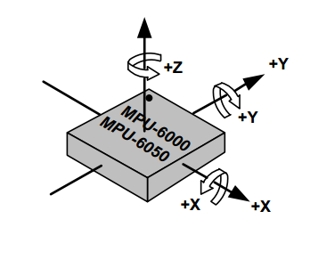

# ROS快捷工具

## urdf显示

安装urdf_tutorials程序包

```bash
sudo apt install ros-melodic-urdf-tutorial -y
```

使用加载urdf模型文件

```bash
roslaunch urdf_tutorial display.launch model:=
```

等号后面跟urdf模型文件的路径及文件名。


## 运行rviz加载指定配置文件

以下指令运行rviz并加载rviz文件夹下的buildmap.rviz文件。

```bash
rosrun rviz rviz -d rviz/buildmap.rviz
```

或者不使用rosrun也可以运行：

```bash
rviz -d rviz/buildmap.rviz
```

不过两种方式都是需要有ros master启动之后才可以运行。


## IMU的方向角

GY-521MPU6050 是三维角度传感器，为全球首例集成六轴传感器的运动处理组件。

这里的六轴，代表的是它内置了一个三轴 MEMS 陀螺仪、一个三轴 MEMS 加速度计，一个数字运动处理引擎（DMP）。它还有用于第三方的数字传感器接口的辅助 I2C 串行接口，比如当辅助 I2C 串行接口连接到一个三轴磁力计，MPU6050 能提供一个完整的九轴融合输出到其主 I2C 端口。 

 下图标明了传感器的参考坐标系（ XYZ组成右手系）以及 3个测量轴和旋转方向。

旋转的正向可用右手螺旋定则判断




在ROS系统中，IMU贴片正面朝上，三轴加速度中Z轴应为正的一个g，由于摆放偏差，可能在其他两轴存在微小的分量；并且静止时无论何轴朝上，该轴加速度都应为正一个g。

三周角速度的正负性符合右手定则。


## rosbag回放

使用两倍速回放rosbag。

```
rosbag play -r 2 --clock bagfile
```


## ROS Melodic官方安装后运行rqt_plot出错的解决办法

在安装完ros-melodic-desktop-full之后，运行rqt_plot时，调整窗口大小会导致报错：

```
Traceback (most recent call last):
  File "/usr/lib/python2.7/dist-packages/matplotlib/backends/backend_qt5agg.py", line 77, in paintEvent
    self.resizeEvent(event)
  File "/opt/ros/melodic/lib/python2.7/dist-packages/rqt_plot/data_plot/mat_data_plot.py", line 110, in resizeEvent
    self.figure.tight_layout()
  File "/usr/lib/python2.7/dist-packages/matplotlib/figure.py", line 2031, in tight_layout
    self.subplots_adjust(**kwargs)
  File "/usr/lib/python2.7/dist-packages/matplotlib/figure.py", line 1881, in subplots_adjust
    self.subplotpars.update(*args, **kwargs)
  File "/usr/lib/python2.7/dist-packages/matplotlib/figure.py", line 241, in update
    raise ValueError('bottom cannot be >= top')
ValueError: bottom cannot be >= top
已放弃 (核心已转储)
```

经检查发现是未安装metaplotlib。

```bash
sudo apt install python-pip
sudo pip install -U matplotlib
```


